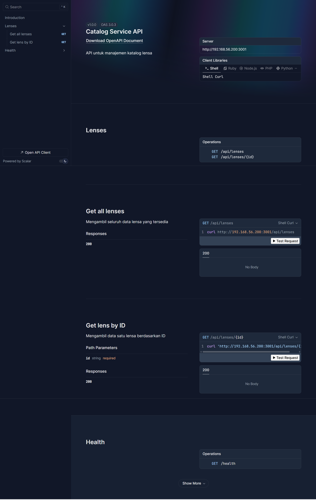
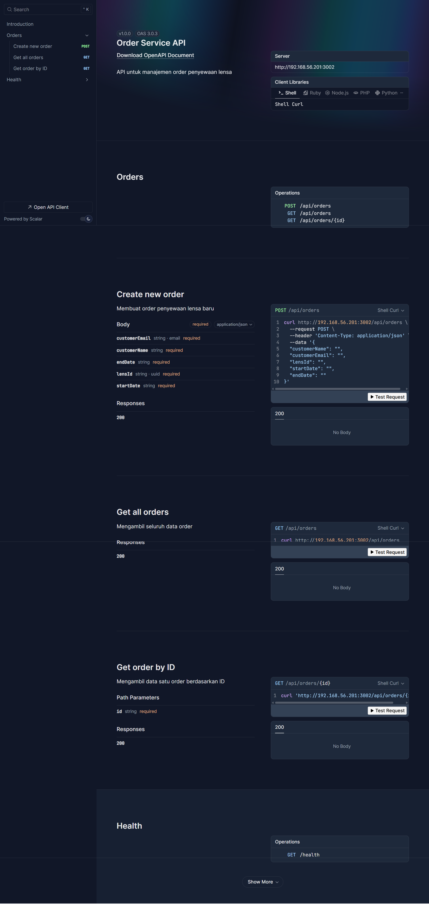
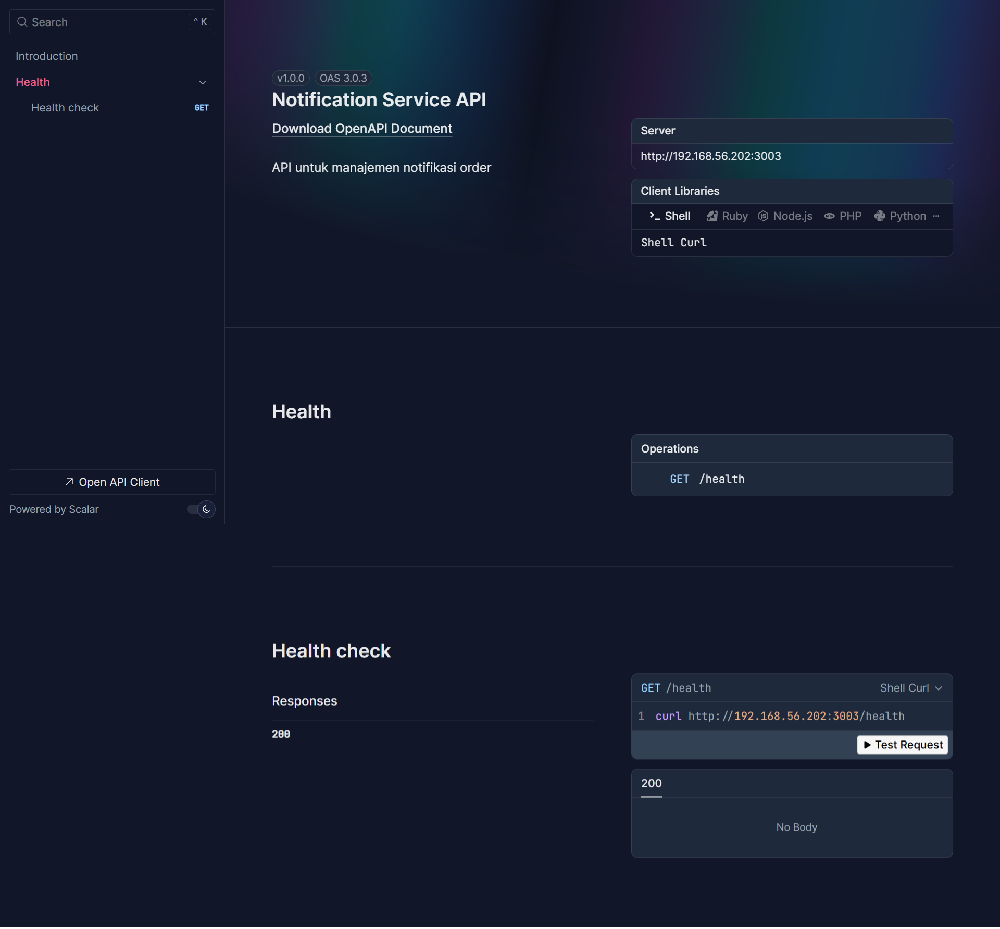
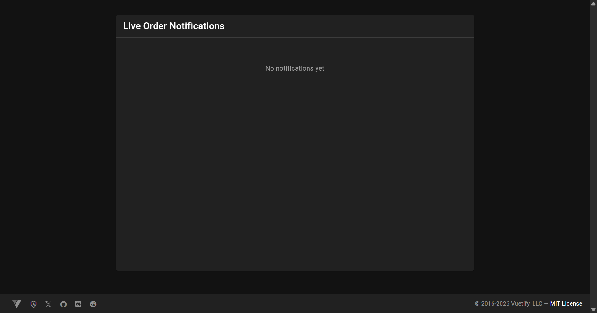
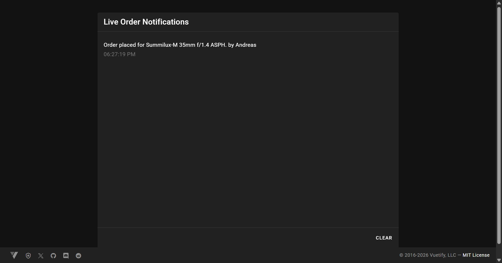
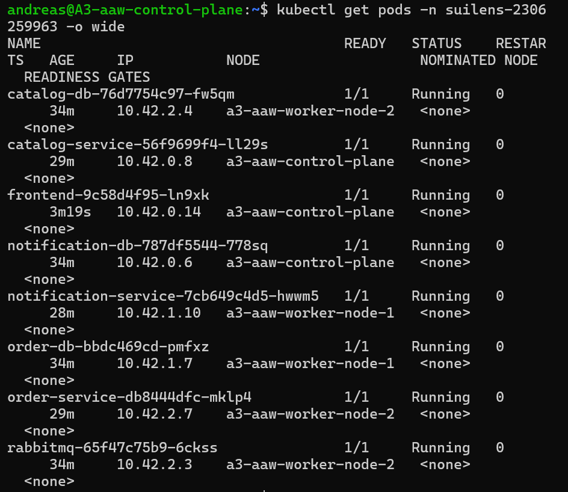

# A03 - API and Kubernetes Deployment

**Nama:** Andreas Timothy  
**NPM:** 2306259963

---

## Implementasi

### OpenAPI Documentation

Dokumentasi OpenAPI ditambahkan pada ketiga service menggunakan plugin `@elysiajs/swagger`. Dokumentasi dapat diakses pada endpoint `/docs` masing-masing service.

#### Catalog Service

#### Order Service

#### Notification Service

---

### WebSocket Notification

WebSocket diimplementasikan pada `notification-service`. Saat order baru dibuat, `order-service` mempublish event `order.placed` ke RabbitMQ. `notification-service` menerima event tersebut dan mem-broadcast notifikasi secara real-time ke semua client yang terhubung via WebSocket.

**Sebelum POST:**

**Setelah POST:**

---

## Kubernetes Deployment

Aplikasi di-deploy ke cluster k3s lokal dengan 1 control plane dan 2 worker node, menggunakan MetalLB sebagai load balancer dan namespace `suilens-2306259963`.

### `kubectl get pods -o wide`

